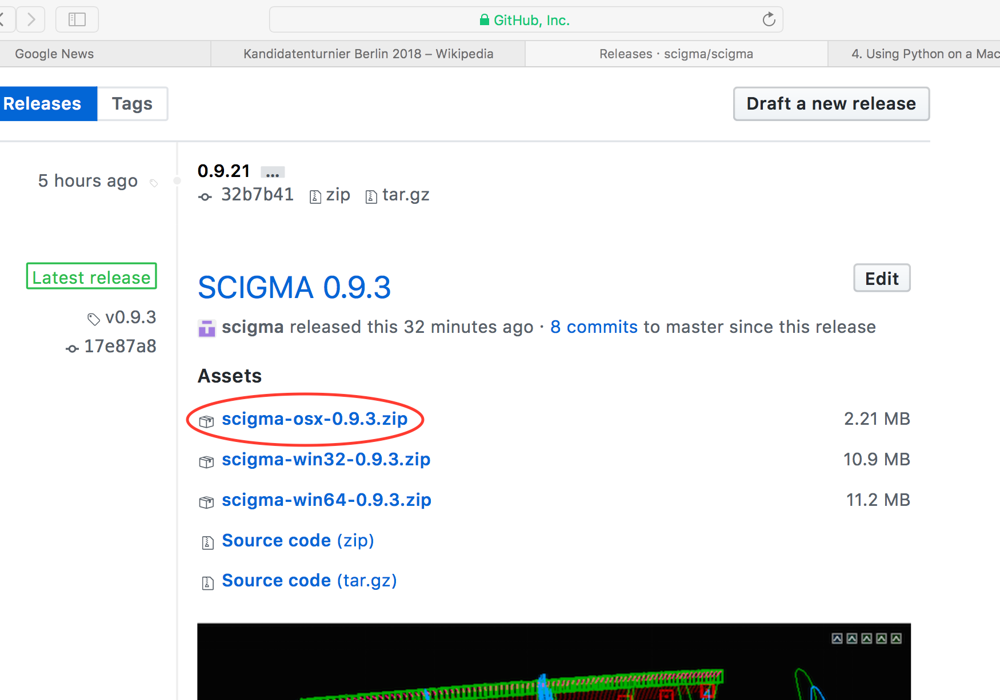
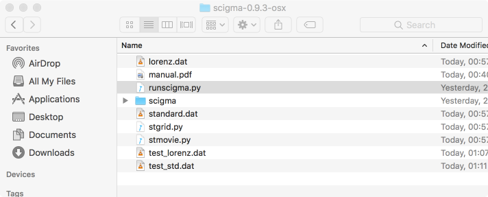
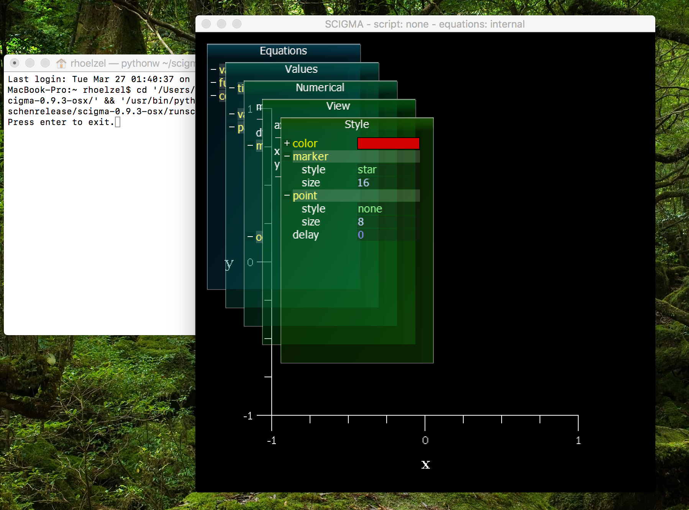

# Install on MacOs

1. Download the latest scigma-osx-X.zip file from [the releases page](https://github.com/scigma/scigma/releases); extract the scigma-osx-X folder somewhere convenient.

    * Note that this is _not_ the scigma-master.zip file you may have downloaded using the "Clone or download" button on the [repository main page](https://github.com/scigma/scigma).

    

4. In the extracted folder, right-click [runscigma.py](https://raw.githubusercontent.com/scigma/scigma/master/runscigma.py) and open with 'Python Launcher' or otherwise open with python from a terminal window: `python runscigma.py`. 

    

